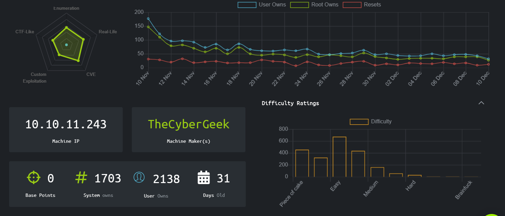
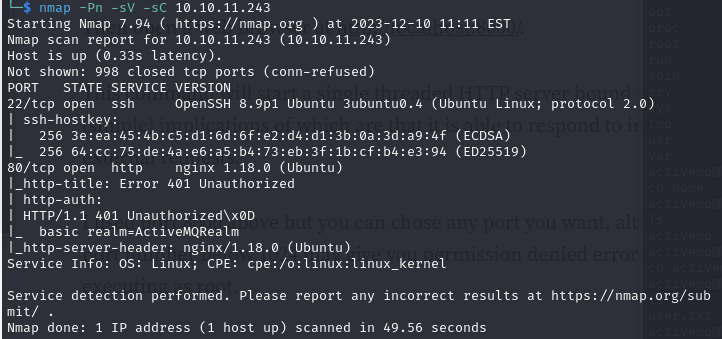
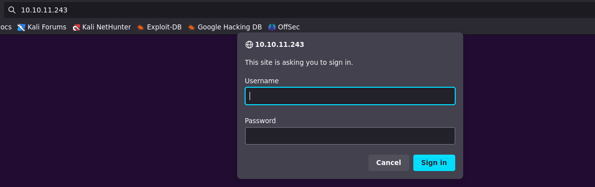
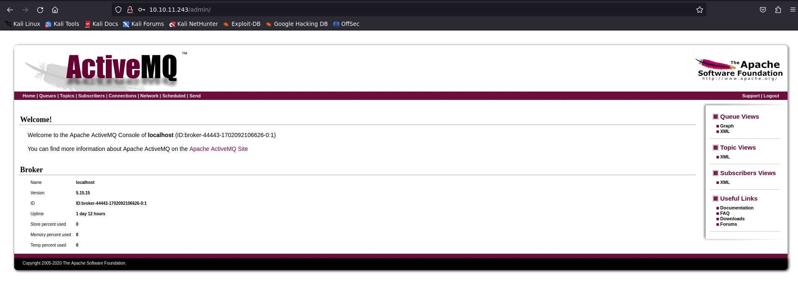
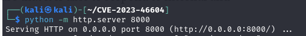
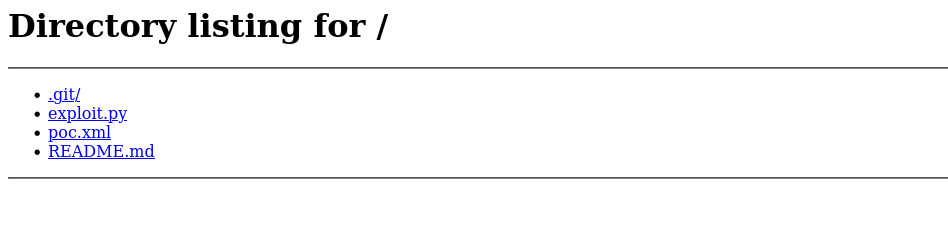
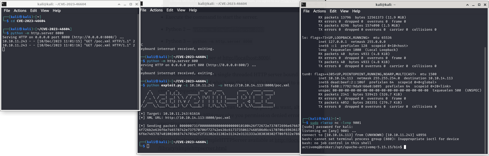
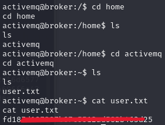

## Broker
  

  
# Walkthrough
I first did a simple scan with nmap that gave me the following result: 
  

  
There is the port 80 open but it returns error 401 Unauthorized.  
I tried to connect through the browser but it asked for credentials.  
  

The first thought went for credentials: admin/admin. Good enough!  
  
  
  
So there is an ActiveMQ server hosted and we have access to the admin's page. A quick look through the web and I found that this type of plaform is affected by the CVE-2023-46604. Also because this is classified as an easy machine on HTB it was with all probabilities the way to get a reverse shell on the server.  
I found this POC that i could use to exploit the CVE https://github.com/evkl1d/CVE-2023-46604.  
The exploit needs the xml file to be reachable via a url from the Apache server. So i set up a Python server on the port 8000 with the command ``` python -m http.server 8000 ``` in the folder of the exploit, so that it could host the poc.xml file.
 

   
Before running the exploit I changed the IP to in the poc.xml to my IP in the HTB vpn and then put a netcat shell in listening. At this point i could run the exploit.  
  
  
  
It worked and now we have a reverse shell on the Apache webserver.  
Browse through the folder to the home directory and then retrieve the user flag.  
  

  
## Privilege Escalation
To be updated...