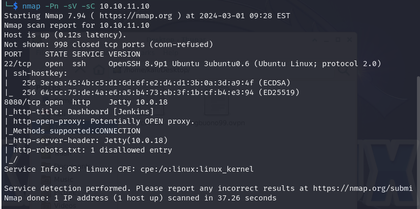

# Builder
Nmap results:  
  
"Potentially OPEN proxy" is to be deepened.  
  
Jenkins open. Connecting via browser:

Found user *jennifer*:  
  
  
Tried to login with weak passwords but couldn't.  
  
Noted that it was the version 2.441 of Jenkins, affected by CVE-2024-23897.  
Found this script https://github.com/Praison001/CVE-2024-23897-Jenkins-Arbitrary-Read-File-Vulnerability. The script didn't work, but it referred to this url:  
https://github.com/vulhub/vulhub/tree/master/jenkins/CVE-2024-23897
  
Following the poc i was able to get the *secrets.key* and *master.key*.  

  
 
I could also get the /etc/passwd, but as far as I could see there was nothing really useful there. Couldn't get /etc/shadow due to missing permission.  
  
With these I could easily get the user flag:  

   

## Privilege escalation 
Found on the web that *"Jenkins uses the master.key to encrypt the key hudson.util.Secret. This key is then used to encrypt the password in credentials.xml."*, so maybe I can use the master.key to decrypt credentials.xml once i got it.
Found this https://www.codurance.com/publications/2019/05/30/accessing-and-dumping-jenkins-credentials. 
As suggested by the article, the best way to get to know how the server directory is done is to start an enviroment on my pc using the opensource docker container of Jenkins.  
  
Done it and found that the file */var/jenkins_home/users/users.xml* contains the name of the folder where the stuff of the user is stored. 
  
I could use again the exploit of the cve to know how is called the directory of jennifer. Unfortunately it didn't work:  
  
  
But the file did exist indeed. So all it takes is to found out how to read the rest of the file.  
Found here https://medium.com/@red_darkin/how-to-replicate-jenkins-cve-2024-23897-arbitrary-file-read-vulnerability-260c8174dd94, that with *connect-node* I should be able to bypass the problem.  
  
Worked, so the directory is in ***/var/jenkins_home/users/jennifer_12108429903186576833***.  
  
On my docker container I found the file *config.xml* in my demo user folder and i found that inside it there is stored the password hash.  
I retrieved that hash for jennifer in the machine's server.  
  
  
It is the following:  
jbcrypt:$2a$10$UwR7BpEH.ccfpi1tv6w/XuBtS44S7oUpR2JYiobqxcDQJeN/L4l1a  
  
Tried to decrypt it with John the ripper:  
  
  
the login credentials are jennifer/princess. Now i can login on Jenkins server with jennifer user.  
  
  
