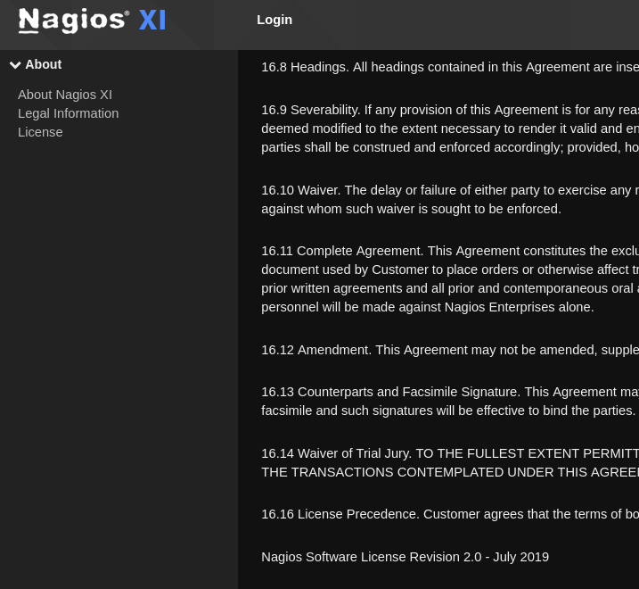

# Monitored
  
  
## Walkthrough  
Nmap scan:  
  
  
Going to that url shows:  
  
  
It is a known service for network monitoring. Tried to navigate to check the version installed.  
Could not find the version directly but discovered under "License" that the version of the license revision is up to July 2019.  
  
I discovered that at that date the version of the Nagios XI last pushed was the 5.6.6. Also, this version is affected by the CVE-2019-15949.   
*"A vulnerabilty exist on Nagios XI allowing an attacker to leverage an RCE to escalate privileges to root. The exploit requires access to the server as the 'nagios' user, or CCM access via the web interface with perissions to manage plugins"*  There is also a POC here: **https://github.com/hadrian3689/nagiosxi_5.6.6**.  
Per questo exploit serve un utente loggato, quindi bisogna prima cercare di ottenere la user flag.  
Ho provato ad utilizzare le credenziali di default trovate online: nagiosadmin:nagiosadmin oppure nagiosadmin:welcome, ma nessuna delle due ha funzionato.  
  
NOTA:  
C'è il servizio LDAP aperto sulla porta 389. Seguendo questo post https://medium.com/@minimalist.ascent/pentesting-ldap-servers-25577bde675b si può provare a verificare se qualche exploit fosse possibile.  
  
Ho continuato la fase di discovery cercando directory con *ffuf*, dando il comando: 
```shell
ffuf -u "https://nagios.monitored.htb/nagiosxi/FUZZ" -w /home/kali/Downloads/directory-list-2.3-medium.txt
```
  
Nota che ho inserito anche */nagiosxi/*, perchè è da lì che immagino ci sia tutta la ramificazione delle directory. Infatti anche la pagina di login sta dopo /nagiosxi/, ovvero: https://nagios.monitored.htb/nagiosxi/login.php.  
La ffuf trova una serie di directory, in particolare: help, tools, mobile, admin, reports, account, includes, backend, db, api, config, views, sounds, terminal. 
  
Molte di queste richiedono l'autenticazione per poter essere accedute, ma andando a ../nagiosxi/terminal. Si apre una shell dal browser:  
  
Anche qui, non sono riuscito a fare nulla perchè non conosco le credenziali.  
La directory /api/ è interessante ma dà forbidden, è disabilitato il directory listing probabilmente. Posso però riprovare il fuzzing dopo /api/. 
I risultati: includes, v1... Ho fermato subito per riprovare subito il fuzzing su v1. 
Ovvero ho ripetuto la ricerca su: *https://nagios.monitored.htb/nagiosxi/api/v1/FUZZ*.  
Questa ricerca dava tantissimi falsi positivi, perchè qualsiasi stringa casuale al posto di FUZZ restituisce questo messaggio:  
.  
Ho cercato sulla documentazione di ffuf che specifica che si possono filtrare le risposte che hanno una certa dimensione. Poichè la dimensione di quella risposta è 32B, ho aggiunto il filtro al comando con ```-fs 32```.  
It found a */authenticate* API and a bunch of nonsense. This API only accepts POST request and it is used to authenticate the users.  Tried to do a dummy post request but of course the response said that the credentials given (none) were not valid.   

Ho ripetuto la nmap, ma stavolta più completa con:  
```nmap -sC -sV -sU -T4 -Pn 10.10.11.248```  
  
  
  
  

Il servizio più interessante è sicuramente SNMP.
Avevo bisogno della community_string del per poter fare una snmpwalk. Ho tentato un approccio bruteforce:  
  
  
Trova la community_string *public*. Eseguo la snmpwalk che elencherà tutti gli OID e il loro valore:  
  
  
Le sole cose interessanti trovate:  
  
  
- Possible utente "Laurel"??
- Credenziali svc, ovvero *svc | XjH7VCehowpR1xZB*.  
    
Ho usato quei dati per per provare a connettermi tramite l'api *authenticate* con una post e così ho ottenuto il token di sessione:  


  
Apparentemente non mi permette nulla quel token di sessione, per questo ho provato ad exploitare quella CVE utilizzando i dati ottenuti:  
  
  
Nulla, perchè non sono quelli i dati di login che vuole lo script.  
Ho ricercato su internet in che modo si potesse utilizzare quel token di sessione. Ho trovato questo sulla documentazione ufficiale: *https://www.nagios.org/ncpa/help/2.0/api.html*.  
Quindi sembra che si possa passare il token come parametro nella URL. Ho rigenerato un nuovo token tramite l'api */authenticate* e ho provato a navigare verso ***https://nagios.monitored.htb/nagiosxi/index.php?token=TOKEN_GENERATO*** ed ha funzionato.  
Sono riuscito a loggare quindi con l'utente *svc* e questa è la dashboard principale:
  
  

## TBC