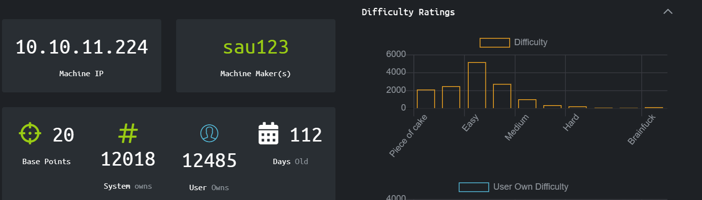
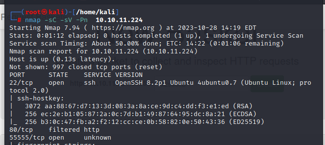
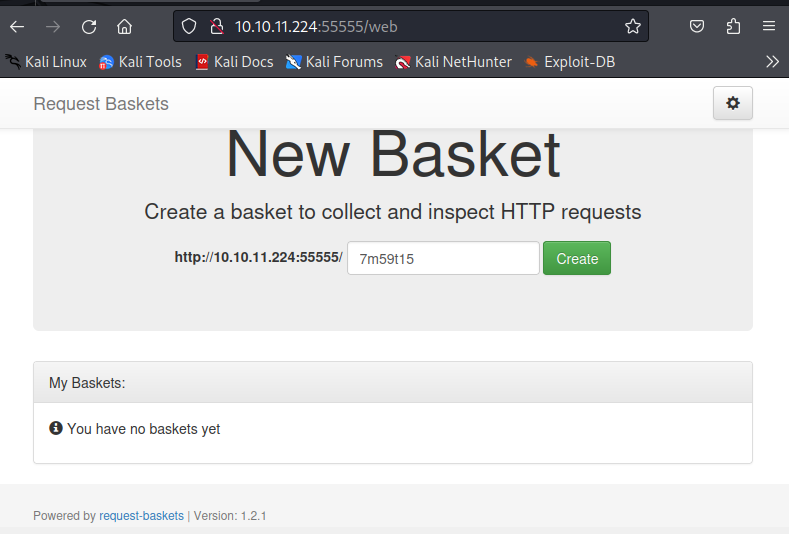

# Sau
 The info to reach the machine can be found on https://www.hackthebox.com/home/machines/profile/551.



## Discovery
The first step was of course check the reachability of the machine with a ping. Done that, the discovery phase could start with a nmap:  
``` nmap -sC -sV -Pn 10.10.11.224```  
  

  
The nmap showed three open ports: 22, 80 and 55555. The last one deserved furthermore investigation.  
The 55555 was open but the service was uknown. The first thing that I tried was to see if that something showed up in the browser, because maybe that way I could get some more information about the service running there.  
  

  
As you can see in the screenshot, I discovered that on the port 55555 it was running the service **request-basket** in the **1.2.1** version.  
A quick search on the web told me that "Request Baskets is a web service to collect arbitrary HTTP requests and inspect them via RESTful API or simple web UI".  
Moreover searching on Google for "request-basket v1.2.1 exploit" it made me discover that there is a well known vulnerability for this service version: the **CVE-2023-27163"**. 
At this point the road is traced, but I needed to study better the protocol and the CVE before passing to the exploitation phase.

## Exploitaiton