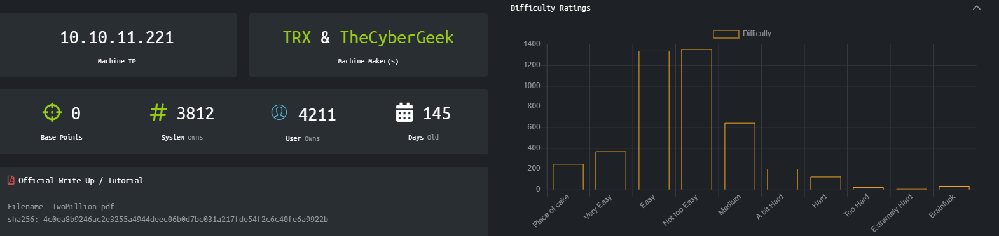
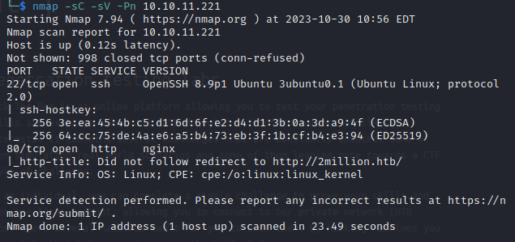
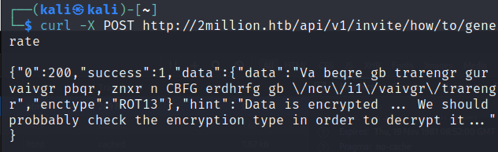

# TwoMillion
The info to reach the machine can be found on https://www.hackthebox.com/home/machines/profile/547.
  
  
## Walkthrough
The first thing as always was an nmap on the network:  
  
  
The port 80 was open and it was running nginx. Also it shows that there was a redirecting to *http://2million.htb/ that was not followed in the nmap.  
I tried to open that URL in the browser but nothing showed up. After a brief search on the web I added this line to the /etc/hosts in the host machine: ```10.10.11.221    2million.htb``` to add that host to the known by the machine.  
Now, opening that URL in the browser shows the old (2017) HackTheBox homepage:  
  

  
I looked in the various tabs to check if I could find something odd, but it seemed like it was all legit.  
At that time to register on HTB you had to go to the /invite url and then try to hack to get the invite code, only then you could register on the platform.  
  

  
So i went on that url and the checked the code of the page and I found this javascript.
```
     $(document).ready(function() {
            $('#verifyForm').submit(function(e) {
                e.preventDefault();

                var code = $('#code').val();
                var formData = { "code": code };

                $.ajax({
                    type: "POST",
                    dataType: "json",
                    data: formData,
                    url: '/api/v1/invite/verify',
                    success: function(response) {
                        if (response[0] === 200 && response.success === 1 && response.data.message === "Invite code is valid!") {
                            // Store the invite code in localStorage
                            localStorage.setItem('inviteCode', code);

                            window.location.href = '/register';
                        } else {
                            alert("Invalid invite code. Please try again.");
                        }
                    },
                    error: function(response) {
                        alert("An error occurred. Please try again.");
                    }
                });
            });
        });
```
  
So basically once you click on submit, the API .../verify is called and the frontend checks if the parameter 'success' is 1 and if the parameter 'data.message' is "Invite code is valid". Done that, the code in the form is stored and set as a cookie for the registration page automatically open.  
At this point I tried something not completely clever...


  
... that of course didn't work.  
I read again the code of the page and noticed a javascript called *inviteapi.min.js* , but its code was minified. I thank ChatGPT for the help here:
```
function verifyInviteCode(code) {
    var formData = {
        "code": code
    };

    $.ajax({
        type: "POST",
        url: '/api/v1/invite/verify',
        dataType: 'json',
        data: formData,
        success: function(response) {
            console.log(response);
        },
        error: function(response) {
            console.log(response);
        }
    });
}

function makeInviteCode() {
    $.ajax({
        type: "POST",
        url: '/api/v1/invite/how/to/generate',
        success: function(response) {
            console.log(response);
        },
        error: function(response) {
            console.log(response);
        }
    });
}
```

It turns out that there's another function *makeInviteCode()* that calls an api on */api/v1/invite/how/to/generate* to generate the invite code.  
  
At this point I did a POST request to that API, hoping to get the invite code in return.
  

  
The answer is encrypted with the ROT13 cipher. It could be easily deciphered with some online tools (or even by hand). The result is the following: **In order to generate the invite code, make a POST request to \/api\/v1\/invite\/generate**
  
I did it and in response I got the invite. I submitted it on the invite page and...

  
... not exactly expected, but i noticed that the string that reminded me a base64 encoding. So i decoded it and got another string, that this time worked as an invite code. I registered to the website and then I could eventually login.  
  

  
